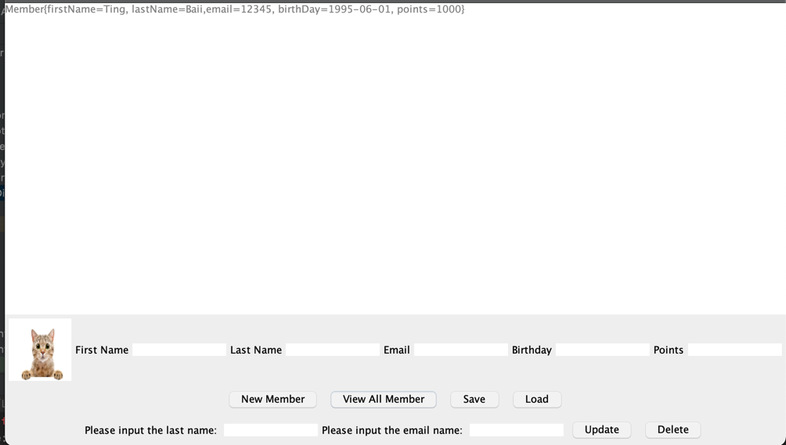
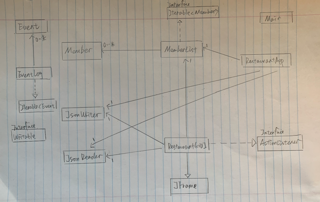

# Restaurant Manager Desktop App
This application designs for restaurant managers collecting consumer's basic information
including name, email, points(can be accumulated for restaurants' coupons) and so on.
Therefore, it's helpful for restaurant to maintain relationship with consumers and attract new consumers.

Many restaurants closed during the pandemic. Therefore, it is vital for restaurants to build consumer loyalty,
and attract new consumers. And a specialized app is a convenient tool for restaurant managers to record their members.
Managers are able to send promotions or birthday coupons etc.

## A subtitle

A *bulleted* list:
- As a user, I want to be able to **add** a new member.
- As a user, I want to be able to **delete** a member.
- As a user, I want to be able to **view** the list of members in my collection.
- As a user, I want to be **change points** for selected member.
- As a user, I want to be able to **save** the entire state of the application.
- As a user, I want to be able to **reload** the previous file and restart at the earlier time.

An example of text with **bold** and *italic* fonts. 

